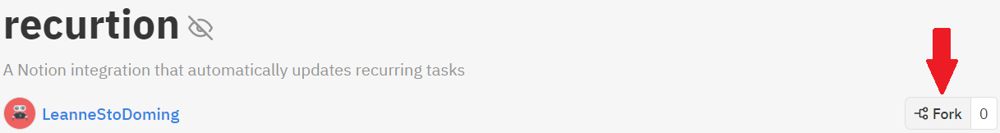
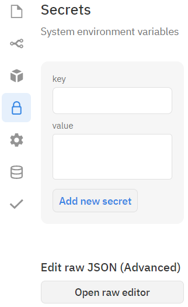
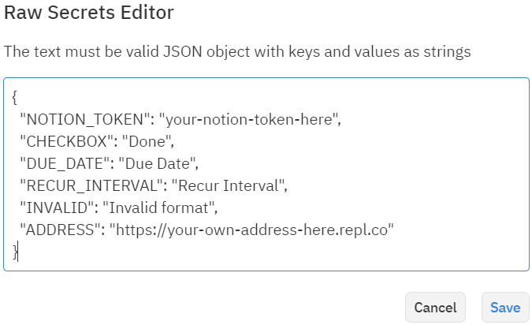
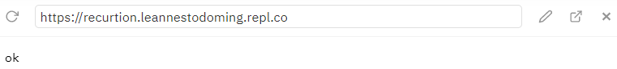

# recurtion

A bot that adds recurring tasks to Notion using the official API

Instructions can also be found [here](https://www.notion.so/Recurtion-Instructions-237146fda1174a9eb6d21e5724a668b4)

**[Set Up Notion](#set-up-notion)** \
**[Set Up Integration](#set-up-integration)**

- **[Option 1 (free): Replit](#option-1-free-replit)**
- **[Option 2 (advanced): self-hosted/VPS](#option-2-advanced-self-hostedvps)**

**[How it Works / How to Use](#how-it-works--how-to-use)** \
**[Limitations](#limitations)** \
**[Upcoming Improvements / Features / Ideas](#upcoming-improvements--features--ideas)**

## Bugs

- There's a known bug where you have to include a time in the Date property for it to work correctly. If you include just the date itself it gives this error: "body failed validation. Fix one: body.properties.Due Date.date.id should be defined, instead was `undefined`. body.properties.Due Date.date.name should be defined, instead was `undefined`. body.properties.Due Date.date.start should be a valid ISO 8601 date string, instead was `"Invalid DateTime"`."

## Set Up Notion

1. Create a table database for the integration to work with

    - Option 1: duplicate this [template](https://www.notion.so/510ec0f4e4864a69a8f5158ab606ad3f)
    - Option 2: create your own database that includes these properties:
        - Checkbox - to indicate if a task has been completed
        - Date - to show when the task should be completed
        - Select or Text - the interval at which the task repeats
          - If it's a Select property, you can include as many options as you like
          - Must include an option for the interval to be invalid (see the template for an example)
    - You can change the names of the properties (remember them for a later step)
    - You can also add as many addition properties as you like since they won't affect how the integration works

2. Go to your [Notion Integrations](https://www.notion.so/my-integrations)

3. Click on **+ New integration**

4. Name the integration, point it to the correct workspace, and click **Submit**

5. You can access the *Internal Integration Token* by clicking **Show** and then **Copy** (you need this for a later step)

6. Go back to the database and click on **Share** in the upper right-hand corner

7. Invite the integration you just made by clicking on **Invite** and then the name that you wrote in **Step 4**

## Set Up Integration

- **[Option 1: Replit](#option-1-replit)**
- **[Option 2 (advanced): self-hosted/VPS](#option-2-advanced-self-hostedvps)**

These steps are loosely based on [An Idiot's Guide to hosting discord bots](https://anidiots.guide/hosting)

### Option 1 (free): Replit

1. Create a [replit](https://replit.com/) account

2. Open the [recurtion repl](https://replit.com/@LeanneStoDoming/recurtion)

3. Fork the repl 

4. The forked repl should open. Go to the **Secrets** tab on the left hand side

5. Click on **Open raw editor**\


6. Copy the code snippet below and paste into the editor

    ```json
    {
    "NOTION_TOKEN": "your-notion-token-here",
    "CHECKBOX": "Done",
    "DUE_DATE": "Due Date",
    "RECUR_INTERVAL": "Recur Interval (select)",
    "INVALID": "Invalid format",
    "ADDRESS": "https://your-own-address-here.repl.co"
    }
    ```

    
7. Replace each value with your own values and save

    - NOTION_TOKEN : get from **Step 5** of **[Set Up Notion](#set-up-notion)**
    - CHECKBOX, DUE_DATE, RECUR_INTERVAL, INVALID : get from **Step 1** of **[Set Up Notion](#set-up-notion)**
    - ADDRESS :
      - option 1 : `https://{name-of-repl}.{your-username}.repl.co`
        - example: `https://recurtion.leannestodoming.repl.co`
      - option 2 : when you run your repl, a small browser should appear with the url on top 

8. Click on the **Run** button at the top of the screen \


9. (Optional) If you want an even more reliable way to keep the program running 24/7, follow these [instructions](https://anidiots.guide/hosting/repl#the-automatic-ping)

10. Enjoy recurring tasks in Notion!

### Option 2 (advanced): self-hosted/VPS

- self-hosted
  - Raspberry Pi
  - computer that's always on
- VPS
  - [DigitalOcean](https://www.digitalocean.com/)
  - [Linode](https://www.linode.com/)
  - [OVH](https://www.ovhcloud.com/en/vps/)
  - etc...

To preform this option, you should be comfortable with using the command line interface. You should also have npm installed on the server you are using. If you don't have npm installed or you aren't sure, follow these [instructions](https://docs.npmjs.com/downloading-and-installing-node-js-and-npm).

1. Clone this repository onto the server

    ```bash
    git clone https://github.com/LeanneStoDomingo/recurtion.git
    ```

2. Go into the new folder

    ```bash
    cd recurtion
    ```

3. Create the environment variables file (these instructions use nano but you can choose any cli text editor that you would like)

    ```bash
    nano .env
    ```

4. Type the code snippet from below into the file

    ```bash
    NOTION_TOKEN=your-notion-token-here
    CHECKBOX="Done"
    DUE_DATE="Due Date"
    RECUR_INTERVAL="Recur Interval (select)"
    INVALID="Invalid format"
    PORT=3000
    ADDRESS=http://localhost:3000
    ```

5. Replace each value with your own values

    - NOTION_TOKEN : get from **Step 5** of **[Set Up Notion](#set-up-notion)**
    - CHECKBOX, DUE_DATE, RECUR_INTERVAL, INVALID : get from **Step 1** of **[Set Up Notion](#set-up-notion)**

6. Save and exit the text editor by pressing `ctrl+x`
    - nano will ask if you want to save the file, so press `y`
    - it will then ask if you want to save it in the same file, so press `enter`

7. (Optional but recommended. Skip to **Step 10** if you don't want to do these optional steps) \
    Open index.js

    ```bash
    nano index.js
    ```

8. Delete everything after the `// web server` comment

    ```javascript
    // web server
    const PORT = process.env.PORT || 3000;

    const server = http.createServer((req, res) => {
        res.writeHead(200);
        res.end('ok');
    });
    server.listen(PORT);

    setInterval(() => {
        http.get(process.env.ADDRESS);
        console.log('pinging server...');
    }, 1000 * 60 * 4);      // pings every 4 minutes

    ```

    ^ all of this should be deleted

9. Save and exit the text editor

10. Initialize node

    ```bash
    npm install
    ```

11. Start the program

    ```bash
    node index.js
    ```

    or

    ```bash
    npm start
    ```

12. Enjoy recurring tasks in Notion!

## How it Works / How to Use

- The integration will run every 5 seconds checking for recurring tasks that have been completed
- The task will be unchecked and the date will be changed to the next due date based on the recur interval set by either the **Select** or **Text** property
- When a rule that you have entered is invalid, the property will change
  - If you are using a **Select** property, it'll change the selected option to the warning message. Example:
    - `every other day`
    - Will change to `Invalid format`
    - A valid option would be `every 2 days`
    - This is why one of the options that have to be in the **Select** property is an invalid indicator. The Notion API doesn't currently support adding a nonexistent option to a **Select** property
  - If you are using a **Text** property, it'll append a warning to the beginning of the text. Example:
    - `every single day`
    - Will change to `Invalid format: every single day`
    - A valid option would be `every day`
- The warning that will be displayed when a rule is invalid comes from the **INVALID** value that you entered in either **Step 7** of **[Option 1: Replit](#option-1-replit)** or **Step 5** of **[Option 2 (advanced): self-hosted/VPS](#option-2-advanced-self-hostedvps)**
  - The default warning message is `Invalid format`
- You can check if your recur interval will work by visiting [this website](https://jakubroztocil.github.io/rrule/) and clicking on the **Text Input** tab
- You can also play around with recur intervals on the **Options** tab and use them by copying from the **rule.toText()** row of the table on the right-hand side

## Limitations

- The integration currently doesn't support a fixed number of recurrences
  - An example of what isn't supported: `every day for 7 days`
  - The integration will ignore the `7 days` part of the interval which means it won't stop after 7 days, it'll just continue
- Also doesn't support exclusions
  - Example: `every day exclude Mondays`
  - Will ignore the `exclude Mondays` part

## Upcoming Improvements / Features / Ideas

- Fix the **[Limitations](#limitations)** mentioned above
- Use OAuth and host a server that people can log in to to run the bot for them without them having to configure their own bot
- Include instructions on how to use the bot on other host servers ([Glitch](https://glitch.com/), [Heroku](https://www.heroku.com/), etc.)
- Track the amount of times a task has been complete (sort of a streak type thing and can be used for habit trackers)
- Option to create new databse items instead of editing an item each time it's completed so there's a history of the tasks that have been done
- Option to create a batch of recurring tasks in the future so the can be seen when planning tasks in advance
